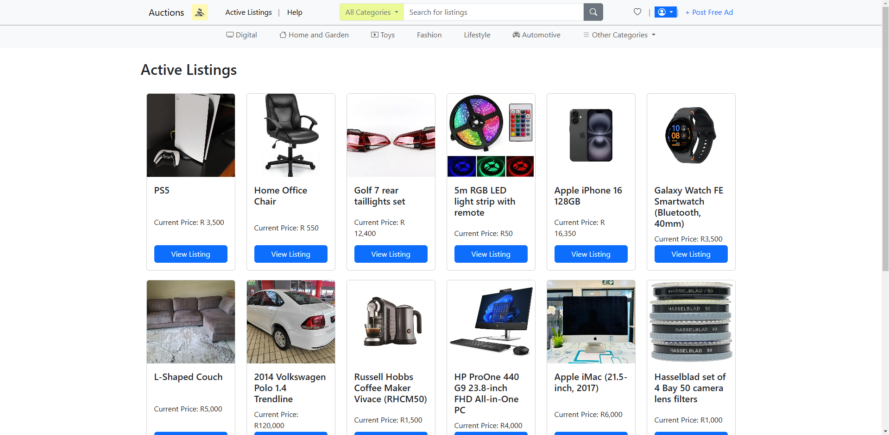
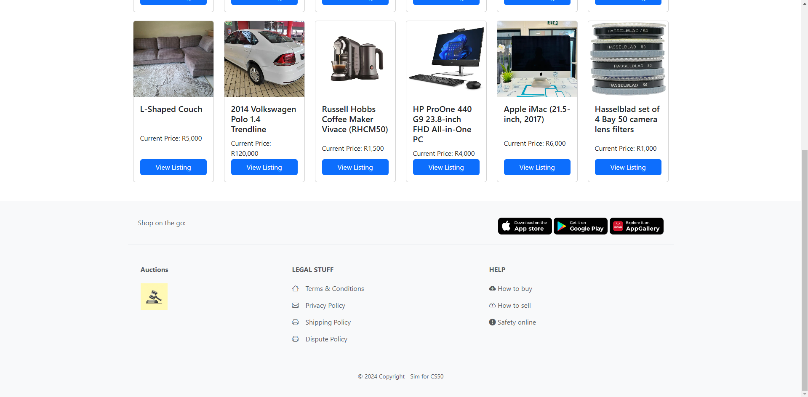
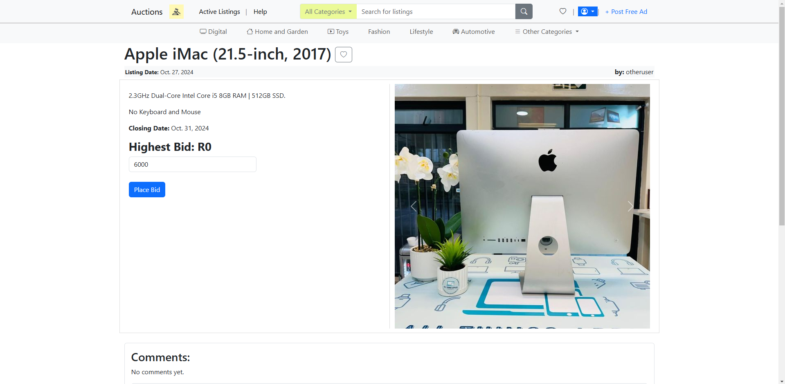
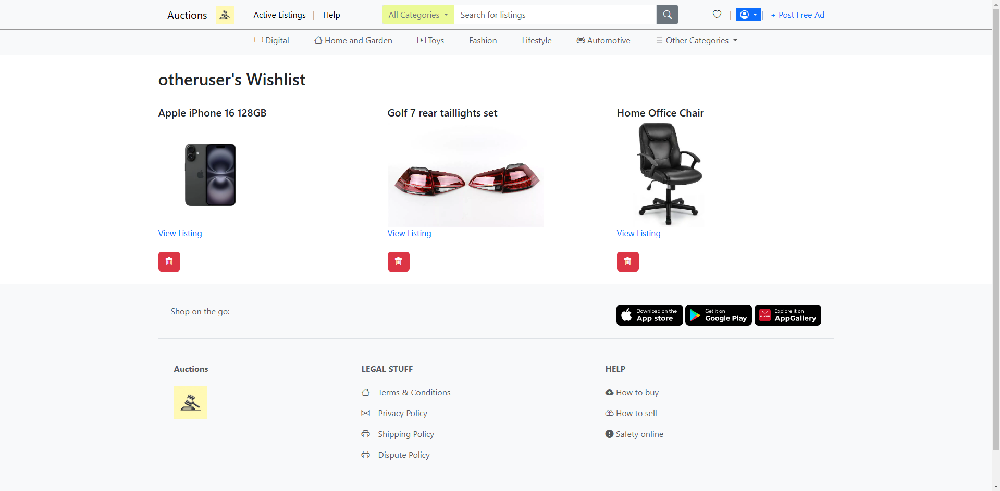
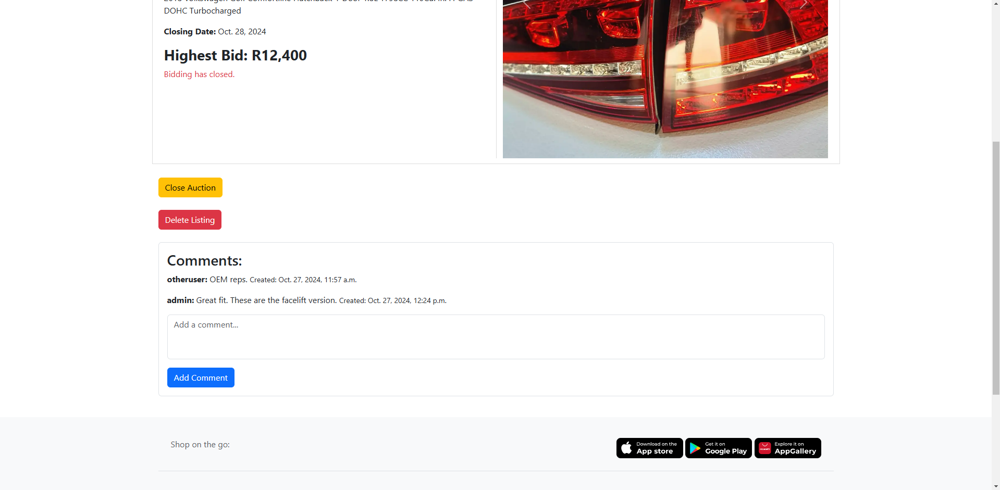

# 'Commerce' Auctions

Commerce is a Django-based web application designed to simulate an online auction platform. This project includes features for creating/deleting/commenting on listings, category filtering, and search functionality.

## Table of Contents

- [Features](#features)
- [Installation](#installation)
- [Usage](#usage)
- [Contributing](#contributing)
- [License](#license)

## Features

- **Listing Creation**: Post ads with Name, Desc, Category, Images, Reserve Price, Auction End date
- **Listing Management**: Bid on, Comment, Wishlist, Close, Delete Listing
- **Search Functionality**: Search entries by name and filter search by category
- **Category Filtering**: View Active and Inactive listings by category

## Installation

To get started with this project, follow these steps:

### Clone the Repository

```sh
git clone https://github.com/simminda/commerce.git
cd commerce
```

## Set Up a Virtual Environment

`python -m venv env`

### Activate the Virtual Environment

- **Windows**

```
.\env\Scripts\activate
```

- **MacOS/Linux**

```
source env/bin/activate
```

### Install Dependencies

`pip install -r requirements.txt`

### Apply Migrations

`python manage.py migrate`

### Create a Superuser (Optional)

Create a superuser to access the Django admin interface:

```
python manage.py createsuperuser
```

### Run the Development Server

Start the Django development server:

```
python manage.py runserver
```

You can now access the application at http://127.0.0.1:8000/

### Contributing

Contributions are welcome! Please open an issue or submit a pull request with your changes.

### License

This project is licensed under the MIT License. See the [LICENSE](LICENSE) file for details.

## Screenshots:

### Landing Page




### View Entries



### Wishlist



### Manage Listings


